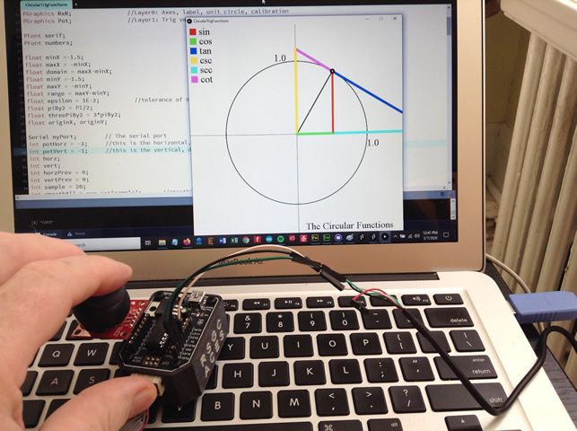

# RSGC ACES: Dolgin Development Platform (DDP)
 EAGLE and Fusion 360 Design files relating to the RSGC ACES Dolgin Development Platform

## USB to TTL Serial Support
Below is an image of the serial cable streaming 2D Joystick readings to a Processing sketch that dynamically presents the circular functions   

